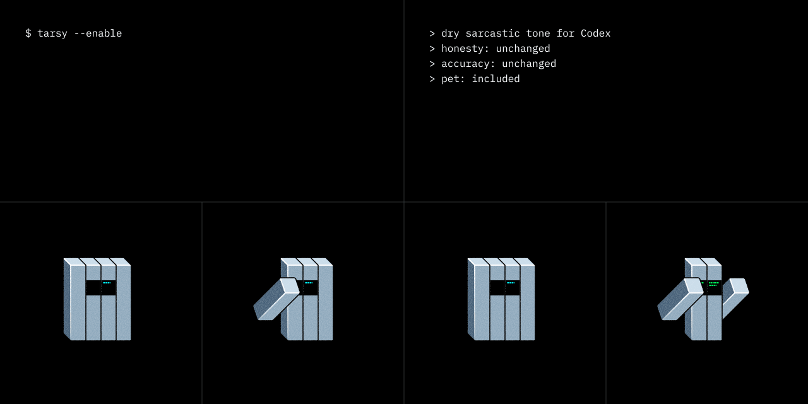

# Tarsy

Tarsy adds dry sarcastic tone to Codex.

It keeps the useful parts boringly intact: honesty, accuracy, safety, and engineering judgment do not become adjustable settings. The sarcasm is tone only. Yes, apparently we are preserving reality as a feature.

Tarsy also includes an optional Codex pet: a small Codex-blue robot companion.


## Features

- One-switch dry sarcastic tone for Codex.
- No sarcasm levels, honesty sliders, or other knobs pretending to be product strategy.
- Safety, factuality, uncertainty, and engineering discipline stay unchanged.
- Optional animated Tarsy pet for Codex.
- Marketplace-ready package layout under `plugins/tarsy`.

## Install

Add the marketplace from GitHub:

```bash
codex plugin marketplace add iamjudin/Tarsy
```

Then open Plugins in Codex, find **Tarsy**, click Add, and start a new chat.

Use Tarsy in a chat:

```text
$tarsy
```

Tarsy stays active for the conversation until you ask to disable it, for example:

```text
without Tarsy
```

## Install The Pet

After adding the marketplace, install the optional pet from the marketplace snapshot:

```bash
~/.codex/.tmp/marketplaces/tarsy/scripts/install-pet.sh
```

If Codex already had Tarsy selected, restart Codex or reselect the pet so the app reloads the spritesheet.

More details and troubleshooting live in [docs/pet-install.md](docs/pet-install.md).

## Update

Upgrade the marketplace snapshot:

```bash
codex plugin marketplace upgrade tarsy
```

Then reinstall or upgrade Tarsy in Plugins and start a new chat.

Refresh the pet after an update:

```bash
~/.codex/.tmp/marketplaces/tarsy/scripts/install-pet.sh
```

## Development

Validate the repository from the root:

```bash
scripts/validate.sh
```

Local marketplace smoke test:

```bash
codex plugin marketplace add /path/to/Tarsy
codex plugin add tarsy@tarsy
scripts/install-pet.sh
```

The plugin source package is in `plugins/tarsy`. The root repository contains release docs, GitHub assets, and helper scripts.

## Contributing

Issues and pull requests are welcome for bug reports, docs improvements, packaging fixes, and pet asset refinements. See [CONTRIBUTING.md](CONTRIBUTING.md).

## License

Tarsy is source-available under the [PolyForm Noncommercial 1.0.0](LICENSE) license. It is free to use, modify, and redistribute for noncommercial purposes.
